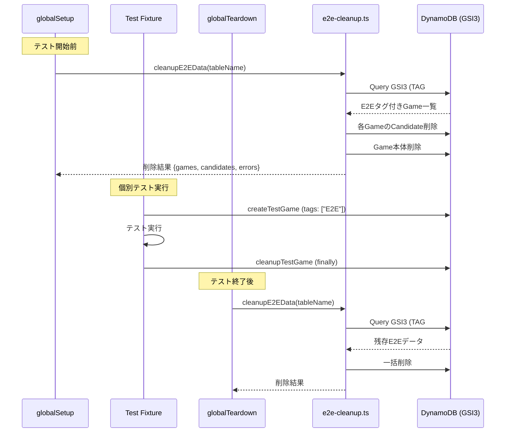

# 設計書: E2Eテストデータクリーンアップ

## 概要

E2Eテスト（Playwright）で作成される対局データのクリーンアップ機能を多層防御アーキテクチャで改善する。

現状、`globalTeardown` のみでクリーンアップを行っているが、テストプロセスの異常終了やCIタイムアウトにより `globalTeardown` が実行されないケースがある。本設計では以下の3層でクリーンアップを実施し、データ残留ゼロを目指す:

1. **事前クリーンアップ（globalSetup）**: テスト開始前に前回残留データを削除
2. **フィクスチャクリーンアップ（test-game.ts）**: 個別テスト完了時にテストデータを削除
3. **事後クリーンアップ（globalTeardown）**: テスト終了後に全E2Eデータを一括削除

また、`cleanupE2EData` 関数を共通モジュールとして切り出し、全レイヤーで同一ロジックを使用する。

### 設計判断

- **共通モジュール化**: `cleanupE2EData` を `e2e/helpers/e2e-cleanup.ts` に移動し、`globalSetup`・`globalTeardown`・フィクスチャから共通利用する。現在 `global-teardown.ts` に直接定義されているが、`globalSetup` からも呼び出す必要があるため分離が必要。
- **エラー耐性**: クリーンアップのエラーはテスト実行を中断しない。事前クリーンアップの失敗はログ記録のみで続行し、事後クリーンアップも同様。
- **GSI3活用**: `TAG#E2E` をパーティションキーとするGSI3でE2Eデータを効率的に検索する。既存のインデックス設計をそのまま活用。

## アーキテクチャ

### 多層クリーンアップフロー



### ファイル構成

```text
packages/web/e2e/
├── global-setup.ts          # 事前クリーンアップ追加
├── global-teardown.ts       # 共通モジュールを使用するよう変更
├── helpers/
│   ├── e2e-cleanup.ts       # 新規: cleanupE2EData共通モジュール
│   └── test-data.ts         # E2Eタグ付与の確認
└── fixtures/
    └── test-game.ts         # finallyブロック強化
```

## コンポーネントとインターフェース

### 1. e2e-cleanup.ts（共通クリーンアップモジュール）

現在 `global-teardown.ts` に定義されている `cleanupE2EData`、`findE2EGames`、`findGameCandidates`、`batchDeleteItems` を新しい共通モジュールに移動する。

```typescript
// packages/web/e2e/helpers/e2e-cleanup.ts

interface CleanupResult {
  gamesDeleted: number;
  candidatesDeleted: number;
  errors: string[];
}

// GSI3でE2Eタグ付きゲームを全件検索
function findE2EGames(tableName: string): Promise<E2EGameItem[]>;

// ゲームに関連するCandidate_Entityを検索
function findGameCandidates(tableName: string, gameId: string): Promise<CandidateItem[]>;

// アイテムをバッチ削除（25件ずつ）
function batchDeleteItems(
  tableName: string,
  items: Array<{ PK: string; SK: string }>
): Promise<number>;

// E2Eテストデータの一括クリーンアップ
export function cleanupE2EData(tableName: string): Promise<CleanupResult>;
```

### 2. global-setup.ts（事前クリーンアップ追加）

既存のサービス可用性チェックの後に `cleanupE2EData` を呼び出す。

```typescript
// 追加部分のインターフェース
export default async function globalSetup(): Promise<void> {
  // 既存: サービス可用性チェック
  // 追加: 事前クリーンアップ
  //   - DYNAMODB_TABLE_NAME未設定時はスキップ
  //   - エラー発生時はログ記録のみで続行
}
```

### 3. global-teardown.ts（リファクタリング）

`cleanupE2EData` のロジックを共通モジュールからインポートするよう変更。

```typescript
import { cleanupE2EData } from './helpers/e2e-cleanup';

export default async function globalTeardown(): Promise<void> {
  // 共通モジュールを使用
}
```

### 4. test-game.ts（フィクスチャクリーンアップ強化）

`finally` ブロック内でのクリーンアップにエラーハンドリングを追加。

```typescript
game: async ({ page: _page }, use) => {
  let game: TestGame | null = null;
  try {
    game = await createTestGame();
    await use(game);
  } finally {
    if (game) {
      try {
        await cleanupTestGame(game);
      } catch (error) {
        console.error(`[TestGame] Cleanup failed: ${error}`);
        // テスト結果に影響させない
      }
    }
  }
};
```

## データモデル

### 既存エンティティ（変更なし）

本specではDynamoDBのスキーマ変更は不要。既存のエンティティ構造とGSI3をそのまま活用する。

#### Game_Entity（E2Eタグ付き）

| 属性   | 値              | 説明                                      |
| :----- | :-------------- | :---------------------------------------- |
| PK     | `GAME#<gameId>` | パーティションキー                        |
| SK     | `GAME#<gameId>` | ソートキー                                |
| GSI3PK | `TAG#E2E`       | GSI3パーティションキー（E2Eデータ識別用） |
| tags   | `["E2E"]`       | タグ配列                                  |

#### Candidate_Entity

| 属性 | 値                                | 説明               |
| :--- | :-------------------------------- | :----------------- |
| PK   | `GAME#<gameId>#TURN#<turnNumber>` | パーティションキー |
| SK   | `CANDIDATE#<candidateId>`         | ソートキー         |

### クリーンアップ結果データ

```typescript
interface CleanupResult {
  gamesDeleted: number; // 削除したGame_Entity件数
  candidatesDeleted: number; // 削除したCandidate_Entity件数
  errors: string[]; // 発生したエラーメッセージ一覧
}
```

### クリーンアップ対象の検索フロー

1. GSI3で `GSI3PK = TAG#E2E` を検索 → E2Eタグ付きGame_Entity一覧を取得
2. 各Game_Entityの `gameId` を使い、`PK = GAME#<gameId>#TURN#<turnNumber>` でCandidate_Entityを検索
3. Candidate_Entityをバッチ削除（25件ずつ）
4. Game_Entity本体を削除

## 正当性プロパティ

_プロパティとは、システムの全ての有効な実行において成り立つべき特性や振る舞いのことです。人間が読める仕様と機械的に検証可能な正当性保証の橋渡しとなります。_

### Property 1: cleanupE2EDataの完全削除

_For any_ DynamoDBテーブルにE2Eタグ付きGame_Entityが N 件（N >= 0）存在し、各Game_Entityに関連するCandidate_Entityが M 件存在する場合、`cleanupE2EData` を実行すると、返却される `gamesDeleted` は N と等しく、`candidatesDeleted` は全Game_Entityの関連Candidate_Entity合計件数と等しく、実行後にGSI3で `TAG#E2E` を検索した結果は0件となる。

**Validates: Requirements 4.2, 4.3, 4.4**

### Property 2: 個別エラー時の継続削除

_For any_ E2Eタグ付きGame_Entityのリストにおいて、任意の位置で個別アイテムの削除がエラーになった場合でも、`cleanupE2EData` はエラーが発生しなかった残りのGame_Entityとその関連Candidate_Entityの削除を継続し、`errors` 配列にエラーメッセージを記録し、正常に削除できたアイテムの件数を正確に返却する。

**Validates: Requirements 2.2, 4.5**

## エラーハンドリング

### 事前クリーンアップ（globalSetup）のエラー

| エラー種別                   | 対応                                                        |
| :--------------------------- | :---------------------------------------------------------- |
| `DYNAMODB_TABLE_NAME` 未設定 | ログ出力してスキップ。テスト実行を継続                      |
| GSI3クエリ失敗               | エラーをログに記録し、テスト実行を継続                      |
| 個別アイテム削除失敗         | エラーをログに記録し、残りの削除を継続                      |
| cleanupE2EData全体の例外     | try-catchでキャッチし、ログ記録のみ。テスト実行を中断しない |

### 事後クリーンアップ（globalTeardown）のエラー

| エラー種別                   | 対応                                                        |
| :--------------------------- | :---------------------------------------------------------- |
| `DYNAMODB_TABLE_NAME` 未設定 | ログ出力してスキップ                                        |
| 個別Game_Entity削除失敗      | エラーをログに記録し、残りの削除を継続                      |
| 個別Candidate_Entity削除失敗 | エラーをログに記録し、Game_Entity本体の削除を試行           |
| cleanupE2EData全体の例外     | try-catchでキャッチし、ログ記録のみ。テスト結果に影響しない |

### フィクスチャクリーンアップ（test-game.ts）のエラー

| エラー種別          | 対応                                                                 |
| :------------------ | :------------------------------------------------------------------- |
| cleanupTestGame失敗 | finallyブロック内でtry-catchし、ログ記録のみ。テスト結果に影響しない |

### 共通原則

- クリーンアップのエラーは**決して**テスト実行やテスト結果を中断・変更しない
- 全てのエラーは `console.error` でログに記録する
- 個別アイテムの削除失敗は残りの削除処理を中断しない

## テスト戦略

### ユニットテスト

既存のテストファイル（`global-setup.test.ts`、`global-teardown.test.ts`、`test-game.test.ts`）を拡張する。

- `e2e-cleanup.test.ts`: 共通モジュールのユニットテスト
  - `cleanupE2EData` が0件の場合に正常に完了すること
  - `cleanupE2EData` がCleanupResult構造を正しく返却すること
  - 個別削除エラー時にエラーを記録して継続すること
- `global-setup.test.ts`: 事前クリーンアップのテスト追加
  - サービス可用性チェック後にcleanupE2EDataが呼ばれること
  - cleanupE2EDataのエラーでテスト実行が中断されないこと
- `global-teardown.test.ts`: 共通モジュール使用への変更テスト
- `test-game.test.ts`: finallyブロックのエラーハンドリングテスト

### プロパティベーステスト

プロパティベーステストライブラリとして `fast-check` を使用する（プロジェクト既存）。

- 各プロパティテストは最低10回実行（`numRuns: 10`、実装ガイドに準拠）
- `endOnFailure: true` を指定
- 各テストにはデザインドキュメントのプロパティ番号をコメントで参照

```typescript
// Feature: e2e-test-data-cleanup, Property 1: cleanupE2EDataの完全削除
it('should delete all E2E-tagged games and candidates', () => {
  fc.assert(
    fc.property(
      fc.array(
        fc.record({
          /* game generator */
        }),
        { minLength: 0, maxLength: 5 }
      ),
      (games) => {
        // Setup: DynamoDBモックにgamesを登録
        // Act: cleanupE2EData実行
        // Assert: 全件削除されていること、戻り値が正確であること
      }
    ),
    { numRuns: 10, endOnFailure: true }
  );
});

// Feature: e2e-test-data-cleanup, Property 2: 個別エラー時の継続削除
it('should continue deletion when individual items fail', () => {
  fc.assert(
    fc.property(
      fc.array(
        fc.record({
          /* game generator */
        }),
        { minLength: 2, maxLength: 5 }
      ),
      fc.nat({ max: 4 }), // エラー発生位置
      (games, errorIndex) => {
        // Setup: errorIndex番目のゲーム削除でエラーを発生させるモック
        // Act: cleanupE2EData実行
        // Assert: エラー以外のゲームが削除されていること、errorsにエラーが記録されていること
      }
    ),
    { numRuns: 10, endOnFailure: true }
  );
});
```

### テストの補完関係

- **ユニットテスト**: 具体的なシナリオ（0件、エラー時、タグ付与確認）をカバー
- **プロパティテスト**: 任意のゲーム数・エラーパターンに対する普遍的な正当性を検証
- 両方を組み合わせることで、具体的なバグの検出と一般的な正当性の保証を両立する
